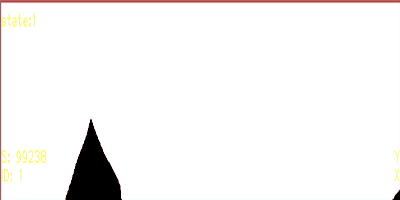

# AbdominalBreathingDetection
OpenCVを主に使用した腹式呼吸の腹部センシング

- クロマキー処理を利用して，Webカメラからの映像の腹式呼吸ができているかの判定する処理です． 
 

  

サンプルのGIFでは左上の**state**に**吸う**と**吐く**の状態を表示しています． 
 
state = 1  :吸う 
state = -1 :吐く 

